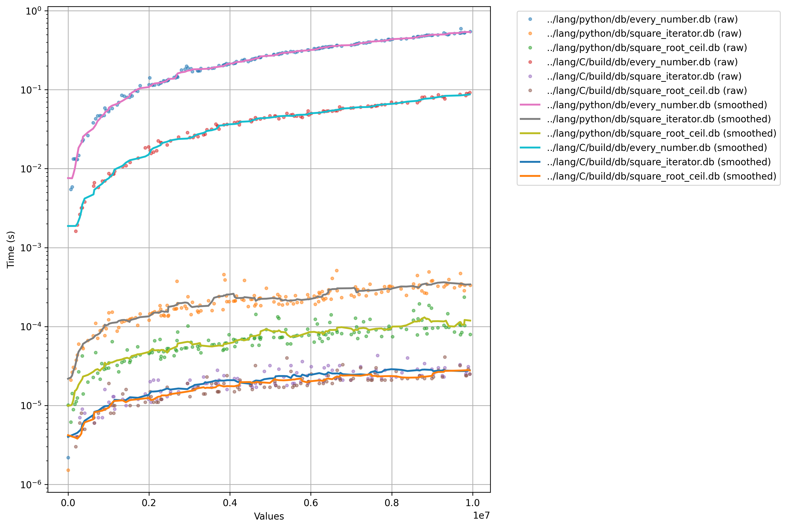

# code_performance_comparison
For this project I want to compare different programming languages ​​based on their performance in known algorithms, find if a number is prime or not. However, it's not the only goal, I also want to do an example on how to use each programming language.

## Project Structure

```plaintext
.
├── 📁 lang/           # Folder for every language
│   └── 📁 C/          # Folder named by the name of the programming language
│   └── 📁 python/
├── 📄 README.md       # Main REAMDE.md of the project
└── 📄 LICENSE         # MIT License for this project
```

## Results

